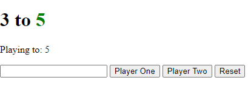

# Fun-Java-Project
A small score-keeper project which can be included in any website. 

* Click on **Player One** or **Player Two** to increase the score of the respective players.
## Win

* As soon as one player reaches the maximum score, the score stops increasing and the winner's score becomes green.
## Change the Maximum Score

* You can change the total maximum score using the input box.
* Use the **RESET** to reset the scores.

